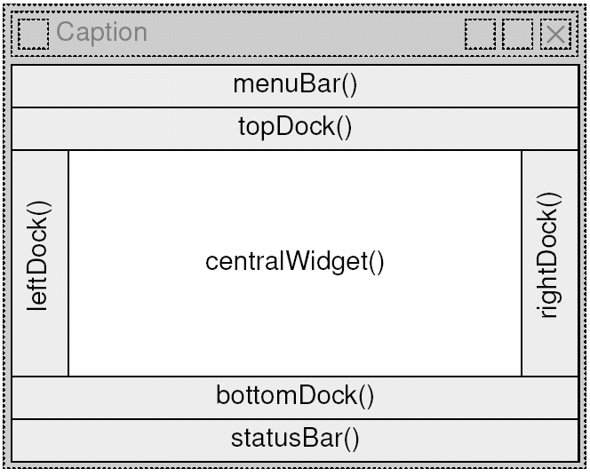
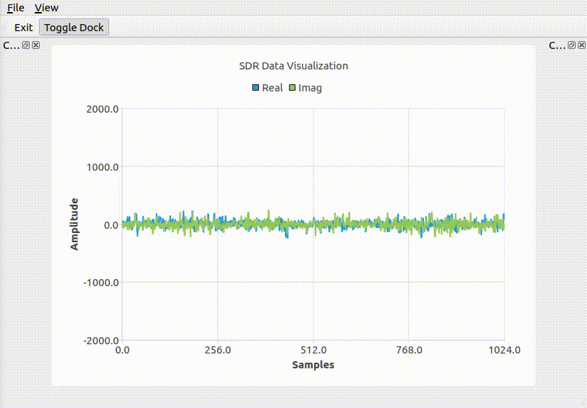

## QT SDR

Раскладка виджетов в главном окне:



Текущий результат:



## Сборка проекта

```
cd QT_SDR/build
```
```
chmod 777 install_dependencies.sh 
```
```
cd ..
```

```
cmake build/
```
```
make
```
```
./qt
```
## Опции

Чтобы отключить установку зависимостей можно запустить CMake с параметром -DINSTALL_DEPENDENCIES=OFF

```
cmake -DINSTALL_DEPENDENCIES=OFF build/
```

По умолчанию он включен
