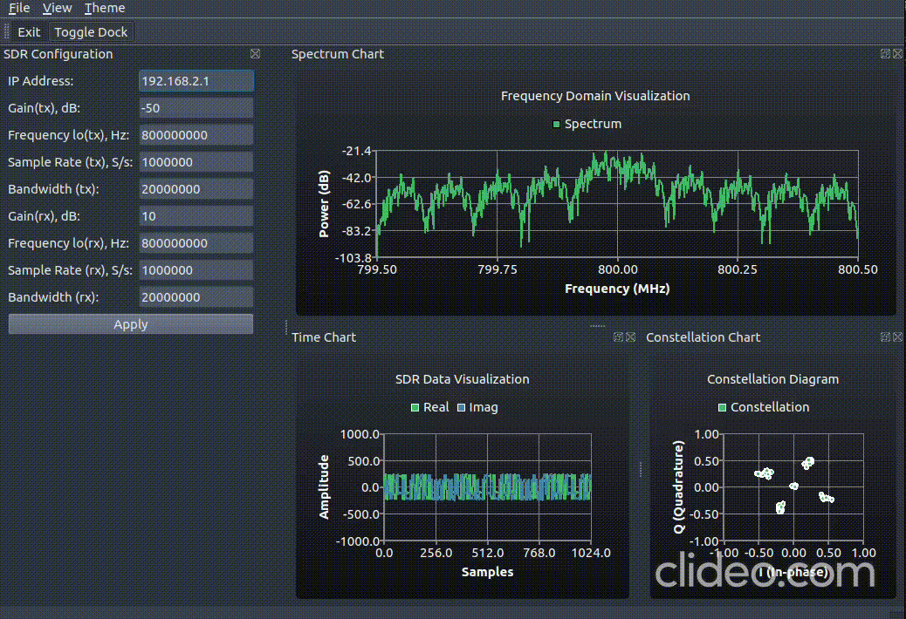

## QT SDR

Раскладка виджетов в главном окне:


Текущий результат:



## Сборка проекта

Клонируем репозиторий:

```
git clone https://github.com/MargQ/QT_SDR
```

Переходим в папку с проектом и собираем его:

```
mkdir build
```

```
cd build
```

```
cmake ..
```
```
make
```

Запускаем:
```
./qt
```
